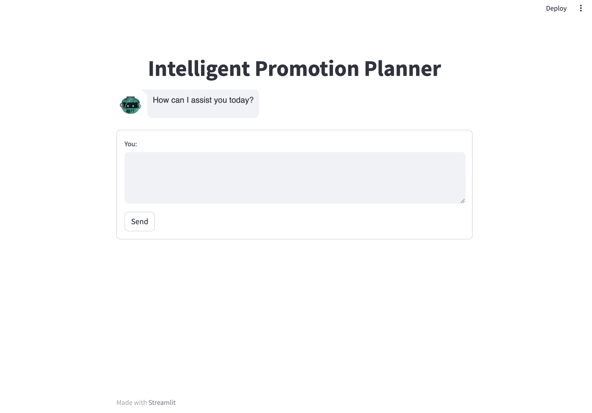

# Promotion Planner Assistant - Chatbot



The **Promotion Planner Assistant - Chatbot** application, powered by SAP AI Core, offers an innovative solution to address key challenges in promotional planning. Leveraging cutting-edge Generative AI predictive models, our platform empowers businesses to make data-driven decisions and optimize promotional strategies effectively.

## Overview

The **Promotion Planner Assistant - Chatbot** is a designed to assist in querying promotional and sales data, focusing on helping businesses optimize their promotional strategies. Users can ask specific questions about upcoming events, product performance, and suggested promotions, and the chatbot responds by querying the relevant dataset. It uses structured prompts to provide precise answers without unnecessary explanations.

## Features

- **Event-based Queries**: Find out about upcoming events for specific quarters or holidays.
- **Product Performance Insights**: Get detailed reports on the best-performing products in various categories (e.g., electronics, furniture) during different promotions.
- **Promotion Recommendations**: Suggest suitable promotions for specific products during key events (e.g., Black Friday, Summer Holidays).
- **Customizable Responses**: Structured prompts allow for consistent and accurate data filtering based on user input.
- **Visual Insights**: Includes graphical visuals such as trends, peaks, and variations in relevant metrics to aid in decision-making.

## Installation

### Prerequisites

Ensure you have:

- Python 3.8+
- Pandas and other necessary libraries listed in `requirements.txt`
- A dataset (in CSV format) that the chatbot can query

### Setup

1. **Clone the Repository**:
    ```bash
    git clone https://github.com/your-username/promotion-planner-assistant.git
    ```

2. **Navigate to the Project Directory**:
    ```bash
    cd promotion-planner-assistant
    ```

3. **Install the Required Dependencies**:
    ```bash
    pip install -r requirements.txt
    ```

4. **Prepare the Dataset**:
   Place your CSV file (e.g., `promotions_data.csv`) in the appropriate directory. The chatbot queries this file to generate responses.

### Running the Chatbot

Run the chatbot using the following command:

```bash
python main.py
```

The chatbot will begin interacting through the command-line interface (or any web interface if implemented), ready to process user queries based on the dataset.

## Architecture

This solution leverages various data sources including promotional data, sales data, and user queries to automatically generate promotions. This system uses a Language Model (LLM) powered by SAP AI Core to process the data and user queries, generating responses in the form of texts and visuals. These visuals include graphs highlighting peaks, highs, and lows for various parameters, providing valuable insights for promotional planners.

### Components

1. **Data Sources**:
   - **Promotional Data**: Contains information about past promotions, including details such as promotion duration, discounts, and products.
   - **Sales Data**: Captures sales metrics over time, including revenue, units sold, and demographics.

2. **Master Data Source**:
   - Aggregates data from various sources into a centralized repository for easy access and analysis.

3. **Language Model (LLM) powered by SAP AI Core**:
   - Processes user queries and data from the master data source.
   - Generates responses in the form of text and visuals.

4. **Visual Output**:
   - **Text Responses**: Provides descriptive information about suggested promotions, including promotion details.
   - **Graphical Visuals**: Presents insights through graphs, highlighting trends, peaks, and variations in relevant metrics.

## Usage

Once the application is running, you can interact with it by following the on-screen instructions at `http://localhost:8501`

## File Descriptions

- **`main.py`**: The main file that starts the application, loading the dataset and waiting for user input.
- **`agent.py`**: Contains the logic for processing user queries and filtering the dataset to return relevant answers.

## Troubleshooting

- **No response for queries**: Ensure that the dataset is loaded correctly and follows the expected format.
- **Incorrect answers**: Check if the data filtering logic in `agent.py` matches the question structure.